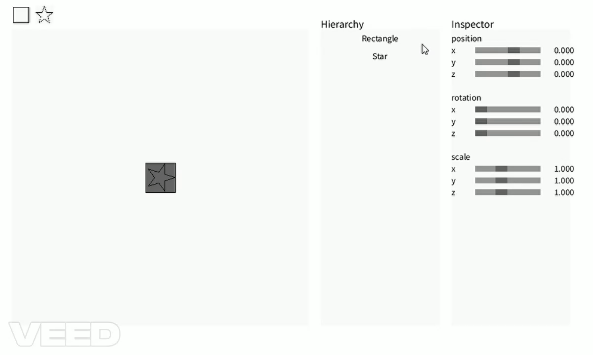
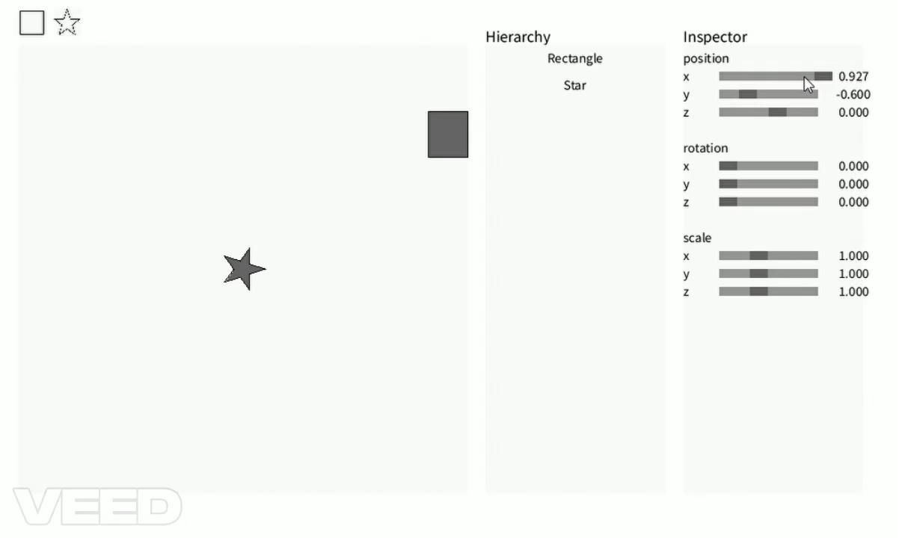

# which tasks you have completed
- Translation Matrix
- Rotation Matrix (Z-axis)
- Scaling Matrix
- Is the point inside a shape?
- Find the boundary of a polygon
- Keep the polygon inside the canvas

# some screenshots of your work
### Translation Matrix & Rotation Matrix (Z-axis) & Scaling Matrix

### Keep the polygon inside the canvas

# how you completed these tasks
### Translation Matrix & Rotation Matrix (Z-axis) & Scaling Matrix
Use ChatGPT told me which index in matrix need to be change the value.
### Is the point inside a shape?
Use ChatGPT half and written by myself half.
### Find the boundary of a polygon
written by myself.
### Keep the polygon inside the canvas
Use ChatGPT half and written by myself half.
